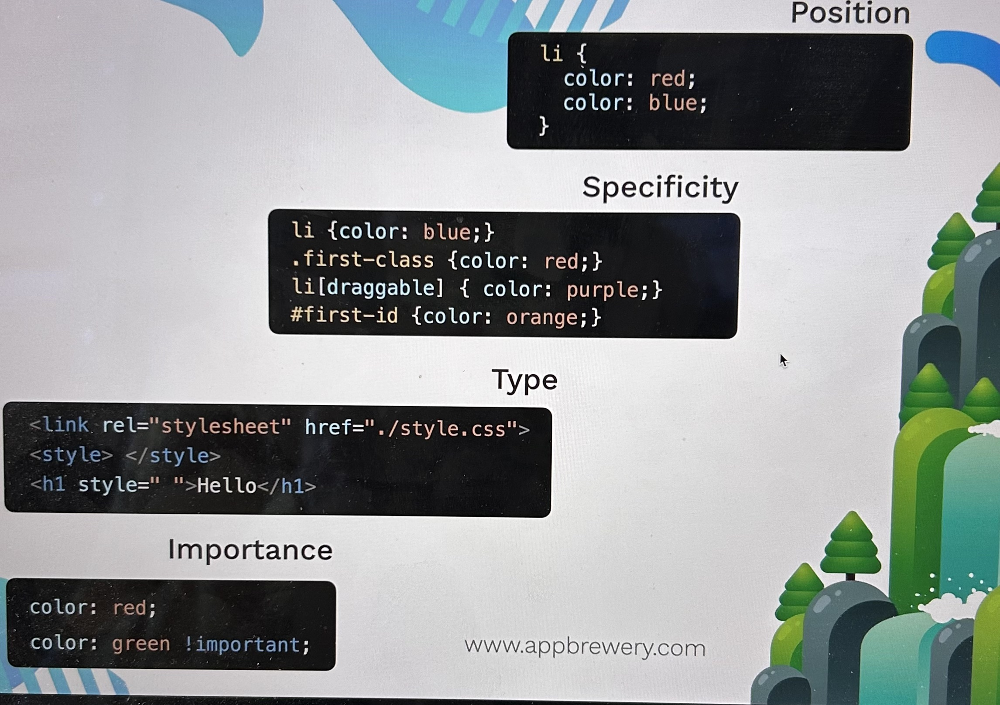

## Heading
1.
```
   <h1> to <h6>
```
2. Life code extension -> html file -> show preview
3.
```
   <h1> - it is only one</h1>
```
4.
```
   <h1> - <h2> - <h3>  - better order
```

## HTML Paragraph Element
```
  <p> text inside </p>
```
Loream Ipsum - for general text

## Self-closing tags
```
<hr/>
/ - forward slash
\ - back slash
<br />

```

https://www.diffchecker.com/
- check different between two text

## Top movies project
https://www.rogerebert.com/reviews

My project - https://github.com/nadezdatsygankova/Full-Stack/tree/main/top%20movies
## The list element
```
//unordered list
<ul>
  <li> hi </li>
  <li> this </li>
</ul>

//ordered list
<ol>
  <li> hi </li>
  <li> this </li>
</ol>

```
Project ->

## Nesting and indenting
```
<ul>
  <li> hi </li>
  <li> this </li>
    <ol>
      <li> h1 </li>
      <li> h4 </li>
    </ol>
</ul>

```
Project ->

## Anchor element

```
<tag attribute=value> Content </tag>

<a href= "https://www.superteacherworksheets.com/generator-word-search.html">Link </a>


```
global attribute - for all tags

Project - Anchor

## Images

```
 //void element
```

```
https://picsum.photos/images/200

where 200 -size of the image
```

https://picsum.photos/images

alt - tools -  Silktide Toolbar

Project - Dog/Cat person

## file path

absolute path

C://users//docement

relative path

../absi -> go to up

./ ->

## webpages

Project is

## The HTML BoilerPlate

```

<!DOCTYPE html> - which version of HTML file
<html lang="en"> - root of the document, language = en
<head>
  <meta charset="UTF-8"> - characters display correctly
  <meta name="viewport" content="width=device-width, initial-scale=1.0"> - how to display web page
  <title>Document</title> - what to display on the tab part
</head>
<body>
</body>
</html>
```
### Project - Portfolio

### Hosting to webserver

local development - all my files in local computer

all files we put in web server - this is web hosting

git hub - new repository, public
index.html and other pages upload
after files are uploaded
settings - pages
branch - main -
we got URL for website


### capstone project
=>

### css
Cascading style sheets - style of the web page

Style sheets languages:
- CSS
- Sass
- Less
and others

we can add css files:

1. inline
just adding css for a single element
```
<tag style='css' />

<html style ="background:green"></html>
```

2. internal
```
<head>
<style>
body{
  background:blue;
  }
</style>

<style>css</style>
```
3.external

we have a file style.css

rel - relationship
href - hyperlink reference
```
<head>
<link rel='stylesheet' type='text/css' href='style.css'/>
</head>

<link href="style.css"/>

```
## css selector

### element selector
```
h1
p
```
### class selector

```
.red-heading{
  color:red;
}
```
## id selector

```
#main{
  color:red;
}
```
## attribute selector
```
[title]
[title='hello']
[title='hello' lang='en']

p[draggable]{
  color:red;
}

p - html element
[draggable] - attribute

p[draggable = "true"]{
  color:red;
}

```

### universal selector

```
*{
  color:red;
  }
```
Project ->

## CSS Properties

### CSS Colors

property - value

```
background-color: red;
color: blue;
```
https://colorhunt.co/
color helpful

### font properties

```
font-weight: bold;
font-style: italic;
font-size: 20px;
font-family: Arial;

```
1px (pixel) - 1/96th inch - 0.26 mm
1pt (point) -word document the same - 1/72th inch - 0.35 mm
1em - 100% of parent
1rem - 100% of root - relative to root - better use it

sans-serif
serif (with some крючочки)

```
text-align: center;
text-decoration: underline;

```

### CSS inspection
Option+ command +I
F12

-> you can use inspect - ... -> CSS Overview
-> you can see all the CSS properties
-> you can edit them
-> you can add new ones
-> you can delete them


### the box model

```
border: 10px solid black;

```

#### content division element

```
<div>
Hello
</div>

```

Pesticide chrome extension for debugging code

Control+C -> hover

Project ->

## Intermediate CSS
### css cascade

1. external style
2. inline style


-> position
what is the position in document of the rule?
```
li {
  color: red;
  color: blue;-> this is will be
}

```
-> specificity

```
li{color: blue;} -> element selector
.first-class{color:red;} -> class selector
li[draggable]{color: purple;} -> attribute selector
#first-id{color: orange;} -> id selector
```
-> type

```
<link rel="stylesheet" href="./style.css"> - external file
<style></style> - internal
<h1 style="color:red;">Hello</h1> - inline style - most important

```
-> importance
```
color: red !important;

```



### combining css
```
<div class= "inner-box" >
    <p>Text</p>
</div>

.inner-box p {
  color: red;
}
```

#### group rule = apply to both selectors

```
selector, selector {
  property: value;
}

```

#### child rule = apply to direct child of left side

```
.parent > .child {
  property: value;
  }

selector > selector{
  color: red;
}

```

#### descendant = apply to descendant of left side

```
selector selector {
  property: value;
}

in all descendant

```

#### chaining selector = apply where ALL selectors are true
- no space
add h1#id.class
start with element

```
selectorselector{
  property: value;
}

h1#first.same{
  color: red;
}

```
#### combining combiners

```
selector selectorselector {
  property: value;
  }

```

### CSS position

#### static - HTML default
- no positioning
- no offset parent
- no z-index
- no clipping
- no scrolling
- no transform
- no transition
- no animation
https://appbrewery.github.io/css-positioning/


#### relative - position relative to default
position relative to default
```
position: relative;

```

#### absolute
- we need to add  position:relative  to the parent

- position relative to nearest positioned ancestor or top left corner of the website

```
position: absolute;
z-index: 1000;
```

#### fixed
- position relative to viewport
- always on top
- no scrolling

```
position: fixed;

```
### css display

#### inline
the same line
- you can't add width and hight
- size = content

```
span {
  display: inline;
}

```

#### block

```
default
h1 {
  display: block;
}

```
#### inline-block
- can have width and height
- can have margin and padding
- can go inline
- can go block

#### none
- no display
- no space
- no margin
```
display: none;

```
https://appbrewery.github.io/css-display/


### css float
wrapping text around element

```
img {
  float: left;
  }

  ```
  text will be all around img

img and paragraph are

display:block;

if we don't want wrapping around after text

```
footer{
  clear:left;
}

or
footer{
  clear:both;
  }
```
### responsive design

#### media-query

below or equal 768 px
```
@media (max-width: 768px) {
  .container {
      width:500px;
  }
}

```
#### css grid

```

```

#### css flex-box

#### external frameworks e.g bootstrap


### media queries

all bigger that 600px

```
@media (min-width: 600px) {
  .container {
    width:800px;
    }
}

```
all the less than 600px
```
@media (max-width: 600px) {
  .container {
    width:400px;
    }

}
```
you can combine them

```
@media (max-width: 600px) and (orientation: landscape) {
  .container {

      width:45px;
  }
}
```

 Mobile Devices: 319px — 480px
 iPads and Tablets: 481px — 1200px
 Laptops: 1201px — 1600px
 Desktops: 1601px and more


### css flexbox

#### flexbox

float only great if you want to float an image to the left or the light of a block of text to the wrap the text around.


```

<div class="container">
   <div class="item">1</div>
   <div class="item">2</div>
   <div class="item">3</div>
</div>

.container {
  display: flex;
  flex-direction: row;
  justify-content: space-between;
  align-items: center;
  padding: 20px;
  background-color: #f2f2f2;
  gap: 10px;
}

```

```
<div> block element </div>
<p> block element </p>
<span> inline element </span>
<a> inline element </a>
 inline element </img>

```

if display: flex
container occupied 100% width
if display: inline-flex
container occupied width of content

#### flex direction

be default
flex-direction: row

if we set
flex-direction: column
from top to bottom

flex-basic: 100px; on the child element

#### flex layout
##### order
```
be default

order: 0;

if we set .green
{
  order:1; - it will be last one
}
```

##### flex-wrap

```
be default
flex-wrap: no-wrap;

you can use to next
property for parent-

    flex-wrap: wrap;

```
##### justify-content
```
for parent
justify-content: flex-start;
justify-content: flex-end;
justify-content: center;
justify-content: space-between;
justify-content: space-around;
justify-content: space-evenly;

```
##### align-items
```
for parent
align-items: flex-start;
align-items: flex-end;
align-items: center;
align-items: baseline;
align-items: stretch;

we need to set height for container

height: 70vh; - viewport height
it should be no wrap
flex-wrap: no-wrap;

----
***
align-items: flex-start;
height: 70vh;
flex-wrap: no-wrap;

---

if you need to set for specific item
align-self: flex-start;
```

https://css-tricks.com/snippets/css/a-guide-to-flexbox/


##### align-content
only works

```
for parent

align-content: flex-start;
flex-wrap: wrap;
height: 70vh;

```

https://appbrewery.github.io/flexboxfroggy/

#### flex sizing

by default
flex items will take up as much space as they need
if there is extra space, it will be distributed evenly

content width < width< flex-basic < min-width/max-width
min-width- longest word - how small they can shrink to
max-width - longest possible line of the text - max to grow

```

flex-grow: 0 or 1; (yes or not) -max-width
flex-shrink: 0 or 1; - min-width

flex-basic:0

flex: 1 1 0; === flex:1;
first - grow
second - shrink
third - basic
if you want equal - basic:0;
default  basic:auto - more space to more content
```
```
/* Write your CSS code below to make the blue items size, grow and shrink like the green ones.*/

.container {
  display:flex;
  justify-content:space-between;
}

.container > * {
}

.item1 {
flex-basic:200px;
}

.item2 {
flex-basis:200px;
flex-shrink:0;
}

.item3 {
flex-basis:200px;
flex-shrink:0;
}

```
### css grid

Flexbox
- inline content
- one dimension
- horizontal or vertical

Grid
- block content
- two dimensions
- horizontal and vertical

```
.container {
  display:grid;
  grid-template-columns: repeat(3, 1fr);
  grid-template-rows: repeat(3, 1fr);
  gap:10px;
  }

  ```

  #### grid size

  ```
  .container {
    display:grid;
    <!-- first rows/column -->
    grid-template: 200px 200px / 300px 300px;
    }

    .container{
      display:grid;
      grid-template-columns: 100px auto; //100%
      grid-template-rows: 100px auto; // fit content

    }

```

https://appbrewery.github.io/grid-sizing/

fractional size

```
.container {
  display:grid;
  grid-template-columns: 1fr 2fr 3fr;
  }

  .container {
    display:grid;
    grid-template-columns: 200px 400px;
    grid-template-rows: 200px minmax(400px, 800px);
  }

.container{
  display:grid;
  grid-template-columns: repeat (2, 200px); //200px 200px
  grid-template-rows: repeat(2, 200px); // 200px 200px

}
```
automaticaly

```
.container {
  display:grid;
  grid-template-columns: auto 200px auto;
  grid-template-rows: auto 200px auto;
  grid-auto-rows: 400px;
  }

```

  inspector -> grid layout

```
.grid-container {
display:grid;
grid-template-columns: auto 400px minmax(200px, 500px);
grid-template-rows: 1fr 1fr 2fr;
grid-auto-rows: 50px;

}

```

#### grid item placement

row tracks
column tracks
grid cells
grid lines (gap)
grid items
grid container

```
.grid-container {
  display:grid;
  grid-template-columns: 200px 400px;
  grid-template-rows: 200px 400px;
  grid-gap: 10px;
  }
  .grid-item{
    grid-column-start: 1 ///left
    grid-column-end: -1 ///right
  }

  grid-column: span 2;
  order: 1;- go to the end of the grid


grid-area: 2 / 1 / 3 /3;
grid-row-start: 2;
grid-column-start: 1;
grid-row-end: 3;
grid-column-end: 3;

https://appbrewery.github.io/gridgarden/

```
#### Mondrian project

in mondrian folder

### bootstap
css framework

```
<head>
<link href="https://cdn.jsdelivr.net/npm/bootstrap@5.3.3/dist/css/bootstrap.min.css" rel="stylesheet" integrity="sha384-QWTKZyjpPEjISv5WaRU9OFeRpok6YctnYmDr5pNlyT2bRjXh0JMhjY6hW+ALEwIH" crossorigin="anonymous">
</head>

<body>

<script src="https://cdn.jsdelivr.net/npm/bootstrap@5.3.3/dist/js/bootstrap.bundle.min.js" integrity="sha384-YvpcrYf0tY3lHB60NNkmXc5s9fDVZLESaAA55NDzOxhy9GkcIdslK1eN7N6jIeHz" crossorigin="anonymous"></script>
</body>


```

col-lg-2
col-sm-4
col-6


#### bootstrap component
```
<html lang="en" data-bs-theme="dark"> // dark mode
```
https://www.w3schools.com/bootstrap/bootstrap_templates.asp

free bootstrap templates

### design website

#### colour theory

red- love. energy. intensity
orange- warmth. excitement. creativity
yellow- joy. intellect. attention
green- freshness. safety. growth
blue- stability. trust. serenity
purple- luxury. creativity. wisdom
pink- playfulness. femininity. sweetness
brown- earthiness. reliability. comfort
grey- neutrality. balance. sophistication
black- elegance. power. sophistication
white- purity. innocence. simplicity

In design we use 2 or 3 colours
1. primary colour
2. secondary colour
3. accent colour
4. background colour
5. text colour
6. hover colour
7. active colour
8. focus colour
9. disabled colour
10. error colour

- analogous colour
 - so close colours
 * navigation bar
 * footer
 * background
- complementary colour
  - opposite colours
* icon
* button

https://color.adobe.com/create/color-wheel

https://colorhunt.co/

#### typography

- serif
  - more serious
  - more formal
  - more traditional
  - more classic

  * old style
  * transitional
  * modern
  * didone
  * slab serif

  San-serif
  - more modern
  - more clean
  - more simple
  - more minimal
  start up loves using this type
   * humanist - very clear- readable
   * geometric

- 2 fonts in one design
  - 1 font for headings
  - 1 font for body

Similar
 * mood
 * time era

Contrast
 * serif-ness
 * weight

 #### user interface design

 1. hierarchy
   - most important information go first
   - use size, colour, and position to create hierarchy
2. Layout
- use grid to create layout
- use white space to create balance
- use alignment to create order
40 characters per line

3. Alignment
- left
- right
- center


- it is better in one line - left
4. White space
- use it to create balance
- use it to create hierarchy
- use it to create order

5. Audience
- know who is the audience
- know what is the audience need

#### user experience design
1. user flow
- create a flow chart to show how user interact with the system
2. user journey
- create a story to show how user interact with the system
3. user research

-- simplicity
-- consistency
-- reading patterns
   - use F layout
   or use Z pattern
-- all platform design
  - use same design for all platform
  - use same design for all device

remove all banners on mobile
-- don't use your powers for evil

#### tasks
https://www.dailyui.co/
examples
https://collectui.com/


font - cardo
subtitle - glacial indifference


website - https://nadiatsy.my.canva.site/

## JS

JavaScript, Ruby, Python are interpreted
Java, C/C+, Swift are compiled

- compiled language is faster
- interpreted language is easier to learn
- compiled language is more secure
- interpreted language is more flexible
- compiled language is more efficient


-console
- sources -> snippet -> can write many different lines -> bottom play button


```
alert("Hello");
```
Idiomatic -

https://github.com/rwaldron/idiomatic.js/

### data type

```
"Hello" - string
123 - number
true / false - boolean
null - null
undefined - undefined
typeof(345) -> number
typeof("hello") -> string
typeof(true) -> boolean
```
variable

```
let name = "John";
let age = 30;
let isMarried = true;

prompt("What is your name?");
let name = prompt("What is your name?");
alert(name)
```
### javascript variable exercise

```
function test() {
    var a = "3";
    var b = "8";

var c = a;
a=b;
b=c;

    console.log("a is " + a);
    console.log("b is " + b);
}

```
### naming and naming convention for javascript variables

cleaning - command + K

snippet - long click to reload button- empty cache and hard reload
```
let name = "John";
let age = 30;
let isMarried = true;
```
name can contains
- number + letters + $ + _
- cannot start with number
- cannot contain space
- cannot contain special character except $ and _
camel casing
- first letter is lowercase
- first letter of each word is uppercase
- example: `let firstName = "John";`
- example: `let isMarried = true;`
- example: `let ageClient = 30;`
### strings
- concatenation
```
let message = "Hello!"
let name = "Nadia"
alert(message +" "+ name);
```

### length
number of characters inside variables or word

```
let name = "Nadia"
console.log(name.length);

//task
let text = prompt("Your text");
alert(text.length);
alert(280-text.length);

```
### slicing and extracting parts of string
- slicing

```
let name = "Nadia"
console.log(name.slice(0,3)); //Nad

tasks
let text = prompt("Your text");
let textAfterSlice=(text.slice(0,184));
alert(textAfterSlice);

```
### changing casing in text
- toUpperCase()
- toLowerCase()

```
let name = "Nadia"
console.log(name.toUpperCase()); //NADIA
console.log(name.toLowerCase()); //nadia

```
```
let text = prompt("Your name");
let lengthText = text.length;
let secondPartOfText = text.slice(1,lengthText)

alert("Hello, " + text.slice(0,1).toUpperCase() + secondPartOfText.toLowerCase());

```
87
### basic arithmetics and the modulo operator

numbers
- addition
- subtraction
- multiplication
- division
- modulo
- exponentiation

```
let a = 5;
let b = 3;
console.log(a + b); //8
console.log(a - b); //2
console.log(a * b); //15
console.log(a / b); //1.6666666666666667
console.log(a % b); //2
console.log(a ** b); //25
if % is 0 => even number
if % is 1 => odd number

```
multiplication - first

```
let dogAge = prompt("What is your dog age?");
let humanAge = (dogAge-2)*4 + 21;
alert("Your dog age is "+ humanAge+ " in human Ages")

```
### increment and decrement expressions
- increment operator ++
- decrement operator --

```
let a = 5;
console.log(a++); //5
console.log(a); //6
console.log(++a); //7
console.log(a); //7
console.log(a--); //7
console.log(a); //6
console.log(--a); //5
console.log(a); //5
a += 5;
console.log(a); //10
```
### function
- function declaration
- function expression
- function call
- function return
- function arguments
- function parameters

```
function greet(name) {
  console.log("Hello, " + name);
  }
  greet("John");
  function add(a, b) {
    return a + b;
  }
    console.log(add(5, 7));

```
https://stanford.edu/~cpiech/karel/ide.html

```
function costOfMilk(bottles) {
  return bottles * 0.25;
  }

costOfMilk(5);

```
if we need round

```
let a = 1.44556
let b = Math.floor(a);
console.log(b); //1
The Math.floor() method rounds a number DOWN to the nearest integer.

```
```
function lifeInWeeks(age) {

    let ageBeetwen = 90-age;
    let days= ageBeetwen*365;
    let week=ageBeetwen*52;
    let month=ageBeetwen*12;
    console.log("You have "+ days+" days, "+week+" weeks, and "+month+" months left.")

}
```
```
function getMilk (money) {
return money % 1.5;
}

let change = getMilk(5);
console.log(change);
```
```
function calculateBottles(startingMoney, costPerBottle){
  let bottles = Math.floor(startingMoney / costPerBottle);
  return bottles;
}

console.log(calculateBottles(100, 5));

function CalcChange(startingMoney, bottles){
  let change = startingMoney % bottles;
  return change;
}

```
```
function bmiCalculator(weight, height)
{
   let BMI = weight/Math.pow(height,2);
   return Math.round(BMI);
}

let BMI = Math.round(bmiCalculator(65,1.69));
console.log(BMI);
```
## Intermediate JS
```
let n = Math.random();
//between 0 - 0.99
n = n * 6;
//if need to range 1-12 we can multiply by 12
n = Math.floor(n) + 1;
//between 1 - 6
```
task
```
let nameFirst = prompt("What is your name?");
let nameSecond = prompt("What is your lover name?");

let random = Math.random();
random= random * 100;
random = Math.floor(random)+1;
console.log("You have "+ random +" % of love");
```
### use if else

comparatives

```
let nameFirst = prompt("What is your name?");
let nameSecond = prompt("What is your lover name?");
let love = prompt("How much do you love your lover?");
let random = Math.random();
random= random * 100;
random = Math.floor(random)+1;
if (random > 50){
  console.log(nameFirst + " loves " + nameSecond + " very much");
  } else {
    console.log(nameFirst + " loves " + nameSecond + " a little");
    }

```
```
=== is equal - the data type is matching
!== is not equal
> is greater than
< is less than
>= is greater than or equal to
<= is less than or equal to

```
```
let nameFirst = prompt("What is your name?");
let nameSecond = prompt("What is your lover name?");
let love = prompt("How much do you love your lover?");
let random = Math.random();
random= random * 100;
random = Math.floor(random)+1;
if (random > 50 && love > 50){
  console.log(nameFirst + " loves " + nameSecond + " very much");
  } else {
    console.log(nameFirst + " loves " + nameSecond + " a little");
    }
 and - &&
 or - ||
 not - !
```
```
BMI calculator

function bmiCalculator (weight, height) {
     let BMI = weight/(height*height);
     let interpretation;
     if (BMI <18.5)
     {
         interpretation = "Your BMI is " +BMI+", so you are underweight.";
     }
     if (BMI >18.5 && BMI <=24.9)
     {
          interpretation = "Your BMI is " +BMI+", so you have a normal weight.";
     }
     if (BMI >24.9)
     {
          interpretation = "Your BMI is " +BMI+", so you are overweight.";
     }

    return interpretation;
}
```
Leap Year Challenge Exercise
```
function isLeap(year) {

if (year%4 == 0)
{
   if (year%100 ==0)
   {
       if(year%400 ==0)
       {
           console.log("Leap year.")
       }
       else
       {
           console.log("Not leap year.")
       }
   }
   else
   {
       console.log("Leap year.")
   }
}
else
{
    console.log("Not leap year.")
}


}
```
### working with javascript arrays

```
// Creating an array
let numbers = [1, 2, 3, 4, 5];
console.log(numbers);
// Accessing an element in the array
console.log(numbers[0]);
// Modifying an element in the array
numbers[0] = 10;
console.log(numbers);
// Adding an element to the array
numbers.push(6);
console.log(numbers);
// Removing an element from the array
numbers.pop();
console.log(numbers);
// Checking if an element exists in the array
console.log(numbers.includes(2));
// Getting the length of the array
console.log(numbers.length);
// Sorting the array
numbers.sort((a, b) => a - b);
console.log(numbers);
// Reversing the array
numbers.reverse();
console.log(numbers);
// Filtering the array
let evenNumbers = numbers.filter(num => num % 2 === 0);
console.log(evenNumbers);
// Mapping the array
let squaredNumbers = numbers.map(num => num ** 2);
console.log(squaredNumbers);
// Reducing the array
let sum = numbers.reduce((acc, current) => acc + current, 0);
console.log(sum);

```

```
let gestsList = ["Anna", "Jena", "Nadia"];
let guess = prompt("What is you name?")

if (gestsList.includes(guess)){
    console.log("Welcome");
}
else {
    console.log("Sorry, you are not in the list");
}

```
### FizzBuzz

push - in the end of the array
pop - take out last item

```
let output =[];

function fizzBuzz (i){
    output.push(i)
    console.log(output);
}

for(i=0; i< 10; i++){
    fizzBuzz (i)
}
```

### Loops
- for
- while
- do while

while
```
let i = 0;
while (i < 10){
  console.log(i);
  i++;
  }
  ```
do while
```
let i = 0;
do {
  console.log(i);
  i++;
  } while (i < 10);
```

#### infinite loop

when the computer will cary on until eternity, and instead crashed your code.

### for loop

```
for (let i = 0; i < 10; i++){
  console.log(i);
  }
```
- let i = 0 - initialize
- i < 10 - condition
- i++ - increment
- console.log(i) - code to be executed

### Fibonacci Challenge
- Create a function that takes a number as an argument and returns the nth number in the Fibonacci sequence
- The Fibonacci sequence is a series of numbers where a number is the addition of the last two numbers
- 0, 1, 1, 2, 3, 5, 8, 13, 21, 34, 55, 89, 144
- The first two numbers in the sequence are 0 and 1
- The next number in the sequence is the sum of the previous two numbers
- The sequence continues indefinitely

### The DOM- 114

- The Document Object Model (DOM) is a programming interface for HTML and XML documents
- It represents the structure of a document as a tree-like data structure
- The DOM is a W3C standard

```
// insert Js
//when body onload
<body onload = "alert('Hello');" >
```
```
<body>
<script type = "text/javascript">
alert(Hello");

</script>
</body>
```
or
external file
at the end of </body>
```
<script src="index.js" charset="utf-8"></script>
//at the end of </body>

```
### introduction to the DOM
- The DOM is a tree-like data structure
- The DOM is a W3C standard
- The DOM is a programming interface for HTML and XML documents
- The DOM represents the structure of a document as a tree-like data structure
- The DOM is used to access and manipulate the elements of a document
- The DOM is used to add, remove, and modify elements of a document

Extension - HTML Tree Generator

https://chromewebstore.google.com/detail/html-tree-generator/dlbbmhhaadfnbbdnjalilhdakfmiffeg

document is the entire html file
```
document.firstElementChild
// everything from <html></html>
document.firstElementChild.innerHTML = "Good bye!";
document.querySelector("input").click();
```
Objects has properties and methods

Method is something that an object can do
Property is something that an object has

### Manipulating and Changing Styles
- The DOM allows you to manipulate and change the styles of elements

```
document.querySelector("h1").style.color = "red";
document.querySelector("h1").style.fontSize = "30px";
document.querySelector("h1").style.fontFamily = "Arial";
document.querySelector("h1").style.visibility =" hidden";
document.querySelector("button").style.backgroundColor =" yellow";
document.querySelector(".PBBEhf").style.backgroundColor = "red";

```
### The separation of concerns
- The separation of concerns is a principle of software design
- The separation of concerns is a way of organizing code

```
document.querySelector("button").classList.add("invisible"); //add a class invisible to the object
document.querySelector("button").classList.remove("invisible"); //remove a class invisible to the object
document.querySelector("button").classList.toggle("invisible"); //toggle a class invisible to the object
document.querySelector("button").classList.contains("invisible"); //check if a class invisible is in the object
document.querySelector("button").classList.replace("invisible", "visible"); //replace a class invisible with a
```
we can save all our styles in style.css and turn on/ off using JS


### Text Manipulation
- The DOM allows you to manipulate the text of elements
- The DOM allows you to get the text of an element

```
document.querySelector("h1").textContent = "Hello World!";// add just text content //Hello World
document.querySelector("h1").innerHTML="Hello"; // all HTML between <h1></h1>
// for example it can be <strong>Hello </strong>
document.querySelector("h1").innerText = "<em>Hello World!</em>";

document.querySelector("h1").outerHTML = "<h1>Hello</h1>"; // all HTML
document.querySelector("h1").innerText = "Hello World!"; // all text
```

### Adding and Removing Elements

```
document.querySelector("h1").attributes;
document.querySelector("h1").getAttribute("class");// check what we have
document.querySelector("h1").setAttribute("class", "new-class"); // add attribute
document.querySelector("h1").removeAttribute("class");


- The DOM allows you to add and remove elements from a document
- The DOM allows you to add and remove elements from a document using the `createElement` method
- The DOM allows you to add and remove elements from a document using the `appendChild` method
- The DOM allows you to add and remove elements from a document using the `removeChild` method
- The DOM allows you to add and remove elements from a document using the `replaceChild` method
- The DOM allows you to add and remove elements from a document using the `insertBefore` method
- The DOM allows you to add and remove elements from a document using the `insertAfter` method
- The DOM allows you to add and remove elements from a document using the `appendChild` method
```
## Boss level challenge 1
project under dice

## Advanced JS

in inspect you can go to the console

```
//show h1 element
$0


//change text of h1 element
$0.innerHTML = "Nadia";

$0.addEventListener("click", respondToClick);
function respondToClick (){
  console.log("You clicked me!");
}
```

```
// in inspect

debugger;
calculator(5,4,add);

```
#### Hight order functions are functions that take other functions as arguments or return functions as output

### 139 How to play sounds on a Website

### JS object
```
let person = {
  name: "Nadia",
  age: 30,
  address: {
    street: "123 main st",
    city: "NYC",
    state: "NY"
    },
    hobbies: ["reading", "hiking", "coding"]
}

```
accessing

```
console.log(person.name);
console.log(person.address.street);

```
construction function

```
function createPerson(name, age, address, hobbies){
  return {
    name: name,
    age: age,
    address: address,
    hobbies: hobbies
    }
}
or
function createPerson(name, age, address, hobbies){
  this.name = name;
  this.age = age;
  this.address = address;
  this.hobbies = hobbies;
  }

  // create
  let person1 = new createPerson("Nadia", "78", "main", ["bike","run"]);
  console.log(person1.name);
  ```
  ### methods

  ```
  function createPerson(name, age, address, hobbies){
    this.name = name;
    this.age = age;
    this.address = address;
    this.hobbies = hobbies;
    this.sayHello = function(){
      console.log("Hello, my name is " + this.name);
      }
}
// create
let person1 = new createPerson("Nadia", "78", "main", ["bike","run"]);
person1.sayHello();

```
keydown

```
document.addEventListener("keydown", function(event){
  console.log(event.key);
  console.log(event.code);
  console.log(event.charCode);
  console.log(event.keyCode);
  console.log(event.altKey);
  console.log(event.ctrlKey);
}
)
```
```
document.addEventListener("keydown", function(event){
  if(event.key === "Enter"){
    console.log("Enter key was pressed");
    }
    }
    )

```
## section 19 - jQuery
### what is jQuery
jQuery is a fast, small, and feature-rich JavaScript library. It makes things simpler for HTML document
traversing, event handling, animating, and Ajax interactions for quicker development and easier maintenance of
web applications.
```
// jQuery
document.querySelector("h1") = jQuery("h1")=$("h1")

```
### how to incorporate jQuery into Website
1. download jQuery from jQuery website
Google CDN
https://developers.google.com/speed/libraries#jquery

2. include jQuery in your HTML file

```
 <script src="https://code.jquery.com/jquery-3.5.1.min.js"></script>
  <script src="./index.js"></script>

```
or
```
$(document).ready(function() {
  $("h1").css("color", "red");
});

```

we can use minify- to min size

### selected elements

```
// get all elements with class name
$(".class-name")
// get all elements with id
$("#id")
// get all elements with tag name
$("tag-name")

// get all elements with attribute
$("[attribute='value']")
// get all elements with attribute that contains value
$("[attribute*='value']")
// get all elements with attribute that starts with value
$("[attribute^='value']")
// get all elements with attribute that ends with value
$("[attribute$='value']")

examples:
$("buttons");
$("#myButton");
$(".myClass");
$("[href='#']");
$("[href*='http']");
$("[href^='http']");
$("[href$='com']");

$("h1").css("color") - we get property
$("h1").css("color", "red") - we set property

```
### DOM manipulation

```
$("h1").text("Bye");
$("h1").html("<b>Bye</b>");
$("h1").val("Bye"); // for input fields
$("h1").attr("class", "myClass");
$("img").attr("src");
$("h1").attr("class", "myClass myClass2");
$("h1").removeAttr("class");
$("h1").removeAttr("class", "myClass");
$("h1").remove();
```
### Event jQuery

```
$("h1").click(function(){
  $("h1").css("color", "purple")
});
$("h1").hover(function(){
  $("h1").css("color", "blue")
  },
  function(){
    $("h1").css("color", "red")
    });

$("input").keypress(function(event){
  console.log(event.key)
  $("h1").text(event.key);
})

$("h1").on("mouseover", function(){
  $("h1").css("color", "red")
})

```
### adding element

```
$("body").append("<p>Bye</p>");
$("body").prepend("<p>Bye</p>");
$("body").after("<p>Bye</p>");
$("body").before("<p>Bye</p>");

```
### removing element
```
$("p").remove();
$("p").empty();
```
### toggle
```
$("h1").toggle();
$("h1").toggle("slow");
$("h1").toggle("slow", "swing");
```
### animation
```
$("h1").animate({left: "100px"}, "slow");
$("h1").animate({left: "100px"}, "slow", "swing");
$("h1").show();
$("h1").hide();

$("h1").fadeout();
$("h1").fadeIn();
$("h1").fadeToggle();

$("h1").slideDown();
$("h1").slideUp();
$("h1").slideToggle();

```
## The Simon Game
folder Simon Game

### Command line
- GUI - Graphical User Interface
- CLI - Command Line Interface
- API - Application Programming Interface

BASH shell - Bourne Again Shell
- `cd` - change directory
- `ls` - list
- `mkdir` - make directory
- `rm` - remove
- `cp` - copy
- `mv` - move
- `touch` - create file
- `echo` - print
- `cat` - print file

- `echo "hello"`
- `echo "hello" > file.txt`
- `~` - root directory
- `.` - current directory
add optional and go through the line
control + a - at the start
control + e - at the end

- `touch Text.txt`
- `open Text.txt`
- `open -a /Applications/PDF\ Reader\ Pro.app Text.txt`
- ` rm text.txt` - remove text
- `rm -r text.txt` - remove text and all files in it
- `rm -rf text.txt` - remove text and all files in it and all subdirectories
- `cp text.txt text2.txt` - copy text to text2
- `cp -r text text2` - copy text and all files in it to text2
- `mv text.txt text2.txt` - move text to text2
-`pwd` - print work directory
- `cd ~` - change to root directory
- `rm * ` - remove all texts inside directory
- `rm -r *` - remove all texts and all files in it inside directory
- `rm -r /Angela` - removed directory
- `rm -rf /Angela` - removed directory and all files in it
https://www.udemy.com/course/the-complete-web-development-bootcamp/learn/lecture/12384438#overview

## Backend tools

1. server = computer connected with network 24/7 on
2. application = logical run to the server, response request
3. database = store user date


Server -> Application -> Database
- server = Apache, Nginx, IIS
- application = PHP, Python, Ruby
- database = MySQL, MongoDB, PostgreSQL

Restaurant
- restaurant - front-end
- server = kitchen
- applications - Chefs
- database = pantry

request- respond = circle of all application

### back-end technologies
front-end
- HTML
- CSS
- JavaScript
back-end
- PHP
- Python
- Ruby
- Java
- C++
- C#
- JavaScript
- SQL
- NoSQL
- MongoDB
- MySQL
- PostgreSQL
- Oracle

## Node.js

Node js - an asynchronus event-driven JavaScript runtime, Node.js is designed to build scalable network application.

use V8 engine

- Node.js = JavaScript run on server
JS Fullstack
Scales
Non-blocking
Event-driven
ecosystem
```
terminal
node -v
```

NOde Read Eval Print Loop
- REPL
- console.log

node
- .exit
- .help
Ctrl +C

file under backend
index.js

terminal
-> node index.js

### native node module
prebuilt courses
- express
- http
- fs

file system
- fs
we can use in our local storage
- readFileSync
- writeFileSync

folder - Native Modules
```
const fs = require("fs");

fs.writeFile("message.txt", "Hello from Nadia", (err) => {
  if (err) throw err;
  console.log("The file has been saved!");
});

fs.readFile("message.txt", "utf8", (err, data) => {
  if (err) throw err;
  console.log(data);
});
```

### Node Package Manager - mpn
- npm init
- npm install
- npm install express
- npm install express@4.17.1
- npm install express@latest

ECMAScript module

```
we can add in package.json
"type":"module",

and in index.js
import express from "express";

```
### QR Code Generator

npm install inquirer.js
npm install qr-image
"type": "module",

npm init -y

## Express framework
js framework
- express
Node allows to run JS in any computer
- express is a framework that allows to run JS on the server
- express is a web framework
- express is a router
- express is a middleware
- express is a server

1. readability
2. less code
3. middleware

Client-Side
- client is the user
- client is the browser
- client is the application
- client is the device

Server-Side
- server is the computer
- server is the application
- server is the device
- server is the machine

1. Create directory
2. Create index.js file
3. Initialise NPM pm init -y
4. Install express npm install express@latest
5. Write Server application in index.js
6. Start server

```
import express from 'express';
const app = express();
const port = 3000;

app.listen(port, () => {
  console.log(`Server is running on port ${port}`);
});

```
7. Run server
```
node index.js

```
http://localhost:3000


To find what ports are listening

```
sudo lsof -i -P -n | grep LISTEN
```

### HTTP
- HTTP is a request-response protocol
Hypertext transfer protocol

-GET -> request resource from the server
-POST -> sending resource to the server
-PUT ->UPDATE- replace the resource - new -PATCH - bicycle
-PATCH ->UPDATE patch up a resource - only wheels
-DELETE -> delete resource

```
1.Create directory
2.Create index.js file
3.Initialise NPM pm init -y
4.Install express npm install express@latest
5.add "type": "module",
6.Write Server application in index.js
7.Start server

Request goes from browser from particular path
console.log(req.rawHeaders);

```
```
import express from 'express';
const app = express();
const port = 3000;

// we receive a GET request to the root URL
app.get('/', (req, res) => {
  res.send('Hello World!');
});

app.listen(port, () => {
  console.log(`Server is running on port ${port}`);
});
```
nodemon

npm i -g nodemon

nodemon index.js

endpoints
- root endpoint
- /users
- /users/:id
- /users/:id/orders
- /users/:id/orders/:id

http://localhost:3000/about

```
app.get('/about', (req, res) => {
  res.send('<h1>About</h1>');
});
```

### Postman

- GET
- POST
- PUT
- DELETE
- PATCH

HTTP Response Status Code
- 200 OK
- 201 Created
- 400 Bad Request
- 404 Not Found
- 500 Internal Server Error
- 401 Unauthorized
- 403 Forbidden
Informational responses (100-199)
Successful responses(200-299)
Redirection messages (300-399)
Client error responses (400-499)
Server error responses (500-599)

inspect
Network
Preserve log - checked

1** - Hold on
2** Here you go
3** - go away
4** - You f**ked up
5** - I (server) f**ked up

---
POST request - usually html form
- sign up
- login
go to server

Postman

## Express Middleware
Middleware is a function that has access to the request object (req), the response object (res),
and the next middleware function in the application’s request-response cycle.

between row request before the go to final destination

- authentication
- authorization
- logging
- error handling
- static file serving

npm body-parser

```
<form action ="/login" method="POST">
<label for="email">Email</label>
<input type="email" name="email" id="email" required>
<label for="password">Password</label>
<input type="password" name="password" id="password" required>
<button type="submit" value="submit"> Login</button>
</form>

```
dynamicly

```
import { dirname } from "path";
import { fileURLToPath } from "url";
const __dirname = dirname(fileURLToPath(import.meta.url));

app.get("/", (req, res) => {
  res.sendFile(__dirname + "/public/index.html");
});
```
1. use npm install the body-parser module
2. run index1.js with nodemon
3. import the body-parser module
4. Mount the middleware using the Express .use() method
5. Specify .urlencoded({extended:true}) to create a body for URL-encoded requests like our form submission
6. Write a .post ("/submit") handler where you console.log() the form contents when the user clicks the submit button

```
import express from "express";
import { dirname } from "path";
import { fileURLToPath } from "url";
import  bodyParser  from "body-parser";

const __dirname = dirname(fileURLToPath(import.meta.url));

const app = express();
const port = 3000;
app.use(bodyParser.urlencoded({ extended: true }));

app.get("/", (req, res) => {
  res.sendFile(__dirname + "/public/index.html");
});


app.post("/submit", (req, res) => {
  console.log(req.body);
  res.sendStatus(201);
});

app.listen(port, () => {
  console.log(`Listening on port ${port}`);
});

```
### custom middleware

Middleware
- pre-processing (example, body-parser)
- post-processing (example, logging)
- error handling (example, error handling middleware)
- authentication (example, authentication middleware)

login - morgan package npm

```
import morgan from "morgan";
app.use(morgan("dev"));

```

### DIY Middleware
- create a function that takes in a request and response object
```
app.use((req,res, next)=>{
  console.log("Request method:", req.method);
  next();
})
```

### project
```
import express from "express";
import { dirname } from "path";
import { fileURLToPath } from "url";
import  bodyParser  from "body-parser";

const __dirname = dirname(fileURLToPath(import.meta.url));


const app = express();
const port = 3000;
let bandName = "";
app.use(bodyParser.urlencoded({ extended: true }));

function bandNameGenerator(req, res, next) {
  console.log(req.body);
  bandName = req.body["street"] + " " + req.body["pet"];
next();
};
app.use(bandNameGenerator);

app.get("/", (req, res) => {
  res.sendFile(__dirname + "/public/index.html");
});


app.post("/submit", (req, res) => {

  res.send(`<h1> Your band name is ${bandName}</h1>`);
  res.sendStatus(201);
});
app.listen(port, () => {
  console.log(`Listening on port ${port}`);
});


```

### Secret project
```
import express from 'express';
import { dirname } from "path";
import { fileURLToPath } from "url";

const __dirname = dirname(fileURLToPath(import.meta.url));

const app = express();
const port = 3000;

let userIsAuthenticated = false;


app.use(express.urlencoded({ extended: true }));

function checkPassword(req, res, next) {
  if (req.body.password === 'ILoveProgramming') {
    userIsAuthenticated = true;
  }
  next();
}


app.get('/', (req, res) => {
  res.sendFile(__dirname + "/public/index.html");
});

app.use(checkPassword);

app.post('/check', (req, res) => {
  if (userIsAuthenticated) {
  res.sendFile(__dirname + "/public/secret.html");
  } else {
    res.redirect('/');
  }
});
app.listen(port, () => {
  console.log(`Listening on port ${port}`);
});
```
## Embedded JS - EJS

Templating

Separation of Concerns
HTML and CSS ||| JS

Structure and style are separated from Functionality
Frontend | Backend
Templating Language
- handlebars
- EJS

```
app post("/submit", (req, res)=>{
  res.render("index.ejs",
  {name: req.body["name]})
}
)

<body>
<h1>
Hello <%= name %>
</h1>
</body>
```
EJS language support plugin

1. Create a new folder called "EJS"
2. Initialize NPM and install express and ejs
3. Create the following files and folders: index.js, views/index.ejs
4. Use the JS getDay() method to build a website that gives advice based on the day of the week


### EJS Tags - 209

```
<% console.log("hello") %> - EJS code , not in output
<%= variable %> - HTML
<%- <h1>Hello</h1>%> - HTML with no escaping (it will be Hello)
<%# %> - Comments
<%== %> - HTML with escaping
<%% %%> - show EJS tag
<% - include ("header.ejs")%> - include another file, for example for footer and header

```
```
let bowl = ["Apple", "Oranges"];
app.get("/", (req, res) =>{
  res.render("index.ejs", {fruits: bowl});
});

<body>
<ul>
<% for (let i =0; i < fruits.length; i++){ %>
<li><%= fruits[i] %></li>
<% } %>
</ul>
</body>
```
Task - EJS-tags
```
<!DOCTYPE html>
<html lang="en">

<head>
  <meta charset="UTF-8">
  <meta name="viewport" content="width=device-width, initial-scale=1.0">
  <title>EJS Tags</title>
</head>

<body>
  <h1>
    <%= title %>
  </h1>
  <p>Current second:
    <%= seconds %>
  </p>
  <% if (seconds % 2 === 0) { %>
  <ul>
    <% items.forEach((fruit) => { %>
    <li>
      <%= fruit %>
    </li>
    <% }) %>
  </ul>
  <% } else { %>
  <p>No items to display</p>
  <% } %>
  <%- htmlContent %>
  <%- include("footer.ejs") %>
</body>

</html>
```
### EJS & Passing Data
important to use local.
```
app.get("/", (req,res)=>{
  res.render("index.ejs");
});
//check if fruits = true
<% if (local.fruits){ %>
<ul>
<% fruits.forEach((fruit) => { %>
<li>
<%= fruit %>
</li>
<%}>%>
</ul>
<% } %>

```
Version with form

```
index.ejs
<form action="/submit" method ="POST">
<input type="text" name="fName" placeholder="Enter your first name">
<input type="text" name="lName" placeholder="Enter your last name">
<input type="submit" value="Submit">
</form>

index.js
app.post("/submit", (req, res) => {
  res.render("index.ejs", { name: req.body["fName] });
  });
```

### EJS Partial and Layouts

We create public folder where we add all static files. It can be images and styles
we can use middleware
public should be in root
```
app.use(express.static("public"));
```

public/styles/content

in ejs
```
<link src="/styles/layout.css">

```
#### Templating

```
<%- include ("header")%>
<%- include ("footer")%>

```
render always relative to location to the view folder

#### Band Generator Project

```
<% if (local.adjective && local.noun) { %>
  <h1>Your band name could be: "The <%= adjective %> <%= noun %>"</h1><% } %>
<% else { %> <h1>Generate a Band Name</h1> <% } %>
```
### GIT, GITHUB and Version Control

Create local repository to track file changes

```
inside folder ->
 -> git init
 staging area
 -> git status
 adding
 -> git add .
 commit in version control
 -> git commit -m "initial commit"
    - Present tense - initial commit
    - Complete Chapter 1
all commit
-> git log

revert changes in my local directory
-> git diff chapter1.txt
-> git checkout chapter1.txt. - file that we want revert to last version was committed
```
#### GitHub and Remote repository
```
//remote created
-> git remote add origin https://github.com/username/repository.git
//push local to remote
-> git push -u origin main

in github -> insights -> Network
```
#### Git ignore

API keys
password
.DS_store files
->  ls -a
see all hidden files

->  touch .gitignore
Undo staging area
-> git rm --cached -r .
if use *.txt -> all txt file will be ignore

#### Git clone

-> git clone url
-> git clone https://github.com/username/repository.git

examples for open source
https://github.com/MunGell/awesome-for-beginners

#### branching and merging

-> git branch name-of-branch
-> git checkout name-of-branch
-> git merge name-of-branch
:q! - exit vs code
-> git push origin main -u

learning -> https://learngitbranching.js.org

#### Forking and PR
when you fork -> you owned
-> you can do everything you like with copy of repositories

-> fork
-> clone
-> create new branch
-> make changes
-> commit
-> push
-> create pull request
-> merge
-> delete branch
-> delete fork

insight - network
# API
## Introduction to APIs
API stands for Application Programming Interface. It is a set of defined rules that enables different applications to communicate with each other. APIs allow developers to access data or functionality from another application, service, or system

- OpenWeather app
they created API

make a request (GET) from my website through the API
API will return data
my website will use the data
API will return data in JSON format

- Mailchimp
  for email
  i post data
  they return successful response

 Different type of API
 - GraphQL
 - REST
 - SOAP
 - gRPC

 it is just set of rules

 REST API
 - use HTTP Protocol to interact with the API
 - use HTTP methods (GET, POST, PUT, DELETE)
 - use HTTP status codes (200, 404, 500)
 - use JSON format to return data
 - use URL to identify resources
 - use HTTP headers to pass additional information
 - use query parameters to pass additional information
 - use body to pass additional information
 - use authentication to secure the API
 - use authorization to secure the API
 - use caching to improve performance

 --- https://wheretheiss.at/
 ISS API
International Space Station

 documentation
 https://wheretheiss.at/w/developer
 1. use postman
 GET https://api.wheretheiss.at/v1/satellites/25544
 2. copy latitude,longitude and put in google map to see location of ISS

## Structuring API Requests

Your server talks with somebody else server using Public API

### API Endpoint
#### BaseURL/Endpoint
- https://api.example.com/users
- https://api.example.com/users/1

#### Query Parameters
- https://api.example.com/users?name=John
- https://api.example.com/users?name=John&age=30
- https://api.example.com/users?name=John&age=30&country=USA
- https://api.example.com/users?name=John&age=30&country=USA&

start with ?
after key-value pair
additional query parameter - &

http://localhost:4000/filter?type=social&participants=2
http://localhost:4000/filter?type=social&participants=2&sort=asc

For filtering and searching

#### Path parameters
/endpoint/{path-parameter}
- https://api.example.com/users/1
- https://api.example.com/users/1/comments

id, username

More for identifying resource by some specific parameter

URL Parameters:

key: The unique key of the activity.
Example Request:

GET https://bored-api.appbrewery.com/activity/3943506

http://localhost:4000/activity/3943506

### JSON
JavaScript Object Notation
It's a way format data that can be sent over the internet in a readable but also efficient way.

It is structured after JS object
key -value
```
{
  "name": "John",
  "age": 30,
  "city": "New York"
}

```
JSON is used for data exchange between web servers, web applications, and web services.
JSON is a lightweight, easy-to-read data interchange format that is widely used in web development.
JSON is a subset of the JavaScript programming language, but it is not specific to JavaScript.

[json](https://jsonviewer.stack.hu)

Serialization
- converting data into a format that can be sent over the internet
```
const jsonData = JSON.stringify(data);
data is JS object;

```
Parse
- converting data from a string into a JS object
```
const data = JSON.parse(jsonData);
```
background - pattern.monster website
- https://www.pattern-monster.com/

### Server-side API request using Node and Axios
- API request that is made from the server to another server
- used for data exchange between servers

My server makes to request to someone server

```
import axios from "axios";
const url = "https://bored-api.appbrewery.com/activity/3943506";
axios.get(url)
.then((response) => {
  console.log(response.data);
  })
  .catch((error) => {
    console.error(error);
    });

 ```
or
```
app.get("/", async (req, res) => {
  try {
    const response = await axios.get("https://bored-api.appbrewery.com/random");
    const result = response.data;
    res.render("index.ejs", { data: result });
  } catch (error) {
    console.error("Failed to make request:", error.message);
    res.render("index.ejs", {
      error: error.message,
    });
  }
});
```

examples
https://docs.zenquotes.io/zenquotes-documentation/

### API Authentication
- API authentication is the process of verifying the identity of a user or client before allowing them to access
- API resources
- API authentication is typically done using a combination of a username and password, or an API key
- API keys are unique strings that are used to identify a client or user
- API keys can be used to authenticate API requests, and can be used to track usage and billing
- API authentication can be done using various methods, including
- Basic Auth
- Bearer Token
- OAuth

4 tiers
0. No authentication
1. Basic Auth
2. API KEY authentication
3. Token Based Authentication

- no authentication
  Rate limit - 100/15 min
  IP address - limit
  public API

- basic authentication

username and password
you have account in API provider
Base64 Encoding in Header
username: password
we convert to Base64
we put in header

https://secrets-api.appbrewery.com/

Postman
GET https://secrets-api.appbrewery.com/all?page=1
Authorization
Basic Auth
username: password

```
nadiard
nadiard
```

First
POST /register
in body
```
{
  "username": "username",
  "password": "password"
  }
```
  "username": "nadiard",
  "password": "nadiard"

- API Key Authorization
client allows to use your server
API key is a string

First
```
GET /generate-api-key
Generates a new API key.

Example Request:

GET https://secrets-api.appbrewery.com/generate-api-key
Example Response:

{
  "apiKey": "generated-api-key"
}
```

I get "apiKey": "74b3d8d3-9994-4c50-9fe3-da59dff14188"


Second

```
GET /filter
Returns a random secret with a particular embarrassment score or higher. API key authentication is required.

Query Parameters:

apiKey: Your API Key generated from the /generate-api-key endpoint.
score: The minimum embarrassment score to filter by.
Example Request:

GET https://secrets-api.appbrewery.com/filter?score=5&apiKey=74b3d8d3-9994-4c50-9fe3-da59dff14188
Example Response:

[
    {
      "id": "1",
      "secret": "This is a secret with embarrassment score 5 or higher.",
      "emScore": 5,
      "username": "user123",
      "timestamp": "2022-10-01T12:34:56Z"
    },
    {
      "id": "2",
      "secret": "Another secret with embarrassment score 5 or higher.",
      "emScore": 7,
      "username": "user123",
      "timestamp": "2022-10-02T10:11:12Z"
    }
    // ... more secrets ...
  ]

  ```
in postman
GET
parameters score 7
authorization
key apiKey
value 74b3d8d3-9994-4c50-9fe3
add to Query Params

- Token Based Authentication
first
User uses
username
password
to login
server generates
token for API

-- OAUTH
Username and password in API provider
API providers generate the token
The token is passed to you as 3-rd party
You can use the token to access the API

for example
our app sign in with Google
google generate the token
and give us the token
we can use the token to access the google API calendar

First
```
POST /get-auth-token
Generates an authentication token for a user. If the user does not exist or the password is incorrect, it will return an error.

Request Body:

{
  "username": "The username of the registered user.",
  "password": "The password of the registered user."
}
Example Request in body

POST https://secrets-api.appbrewery.com/get-auth-token
{
  "username": "jackbauer",
  "password": "IAmTheBest"
}
Example Response:

{
  "token": "generated-auth-token"
}
```
I get
```
 {
    "token": "389f3fdc-b685-44a5-bfea-c5f95f3bff5a"
}
```
Second

```
GET /secrets/{id}
Returns the secret with the specified ID. Bearer token authentication is required.

URL Parameters:

id: The ID of the secret to retrieve.
Example Request:

GET https://secrets-api.appbrewery.com/secrets/1
Example Response:

{
  "id": "1",
  "secret": "This is a secret.",
  "emScore": 3,
  "username": "user123",
  "timestamp": "2022-10-01T12:34:56Z"
}
```


### REST API
https://axios-http.com/docs/example

Modern version
```
// Want to use async/await? Add the `async` keyword to your outer function/method.
async function getUser() {
  try {
    const response = await axios.get('/user?ID=12345');
    console.log(response);
  } catch (error) {
    console.error(error);
  }
}

```
.then - old version


### API project

https://github.com/appbrewery/public-api-lists

My project is [Book dictionary app ](https://github.com/nadezdatsygankova/book-dictionary-app)

## Build your own API

### DIY API

Public APIs

Rapid API
https://rapidapi.com/
https://rapidapi.com/hub

1. You have a large Data Collection
2. Algorithm/ Service than people can using you API - ChatGPT
3. Simplify interface - domino's pizza API

Internal APIs
- not support for external use
- but somebody can use it

REST API
What makes an API RESTful?
Rule
1. Use HTTP methods (GET, POST, PUT, PATCH, DELETE)
2. It should standard have a standard data format that it responds with.
It can be JSON format, the JS Object Notation, or something like XML
This is response to calling the API and the response is given back to the client and RESTful APIs
3. Client- Server are completely separate.
They are not on the same system or in the same file and they're able to message each other over a network.
The can message to each other to order to make requests and also to get back responses.
And this part of the RESTful API architecture allows each side to be able to scale independently from each other and they can evolve and be completely build separately by different people, which means that RESTfull API allows the whole system to scale very easily.

4. Statelessness
Each request from the client to the server should contain all the information
that's needed understand and process the request.
So the server shouldn't storing any sort of client side, state or client side data between the requests.

Each single request can be completed and each single response is also complete without need to know what happened previously

5. Resource - Based
API that is centered around resources and uses a Unique Resource Identifier, also known as a Resource Locator,
(URI/URL)in order to locate specific resources.

The Internet - implementation REST- API

Joke API
https://documenter.getpostman.com/view/6048123/2s9XxsTv8Y

project is in DIY API folder
we use postman to get request

req.params.id = string
parseInt(req.params.id) -> convert in integer

```//1. GET a random joke

app.get("/random", (req, res)=>{
  const randomIndex = Math.floor(Math.random()* jokes.length);
  res.send(jokes[randomIndex])
})


```
find (callback)
if true => return object

```
//2. GET a specific joke
app.get("/jokes/:id", (req, res) => {
  const id = parseInt(req.params.id);
  const foundJoke = jokes.find((joke) => joke.id === id);
  res.json(foundJoke);
});

//3. GET a jokes by filtering on the joke type
app.get("/filter", (req, res) => {
  const type = req.query.type;
  const filteredActivities = jokes.filter((joke) => joke.jokeType === type);
  res.json(filteredActivities);
});
```
POST
Postman
POST
->
x-www-form-urlendcoded
text
type

```
app.post("/jokes", (req, res) => {
  const newJoke = {
    id: jokes.length + 1,
    jokeText: req.body.text,
    jokeType: req.body.type,
  };
  jokes.push(newJoke);
  console.log(jokes.slice(-1));
  res.json(newJoke);
});
```

PUT
Completely replace a joke based on the path parameter id specified.
text
type

```
//5. PUT a joke

app.put("/jokes/:id", (req, res) => {
  const id = parseInt(req.params.id);
  const existingJoke = jokes.findIndex((joke) => joke.id === id);
  const replacementJoke = {
    id: id,
    jokeText: req.body.text,
    jokeType: req.body.type
  };
  jokes[existingJoke] = replacementJoke;
  res.json(replacementJoke);
});
```
PATCH
```


app.patch("/jokes/:id", (req, res) => {
  const id = parseInt(req.params.id);
  const existingJoke = jokes.find((joke) => joke.id === id);
  const replacementJoke = {
    id: id,
    jokeText: req.body.text || existingJoke.jokeText,
    jokeType: req.body.type || existingJoke.jokeType,
  };
  const searchIndex = jokes.findIndex((joke) => joke.id === id);
  jokes[searchIndex] = replacementJoke;
  console.log(jokes[searchIndex]);
  res.json(replacementJoke);
});
```
DELETE
```
//7. DELETE Specific joke

app.delete("/jokes/:id", (req, res) => {
  const id = parseInt(req.params.id);
  const searchIndex = jokes.findIndex((joke) => joke.id === id);
  if (searchIndex > -1) {
    jokes.splice(searchIndex, 1);
    res.sendStatus(200);
  } else {
    res
      .status(404)
      .json({ error: `Joke with id: ${id} not found. No jokes were deleted.` });
  }
});

/8. DELETE All jokes

app.delete("/jokes", (req, res) => {
  if(req.query.key !== masterKey){
    res.status(401).json({error: "Unauthorized"})
    return;
  } else {
  jokes = [];
  res.sendStatus(200);
  }
});

```
### Build your own API for blog

folder Blog+API+Project
nodemon server.js
nodemon solution.js

# Databases
## SQL and NoSQL
Data storage

Types of Databases
SQL DB
 structured query language
 table with name, password
 relational database - relations between tables
 Oracle database
 MySql
 PostgreSQL

 NoSQL DB
 flexibility
 can modify on the fly
 we can change to modify
  MongoDb
  Radis
  DymanDb

## SQL
### SQL Commands CREATE Table and INSERT Data
https://sqliteonline.com/

Create
Read
Update
Destroy

CRUD
```
CREATE TABLE customers (
   id int,
   first_name varchar(255),
   last_name varchar(255),
   address varchar(255)
  );

```
```
CREATE TABLE products (
   id int NOT NULL,
   name varchar(255),
   price MONEY,
   PRIMARY KEY (id)
  );

```
```
INSERT INTO products
VALUES (1, 'Pen', 1.5);
```
Show everything
```
Select * from products
```
### READ
```
SELECT name, id from products
SELECT name, id from products where price >1

```
### UPDATE
```
UPDATE products
SET price = 2.6
WHERE id =2
```
Add new column to the table

```
ALTER TABLE products
ADD stock MONEY;

```
### Destroy

```
DELETE FROM products
WHERE id = 2

```
### relationship
```
CREATE TABLE orders (
  id INT Not NULL,
  order_number INT,
  customer_id INT,
  product_id INT,
  PRIMARY KEY (id),
  FOREIGN KEY (customer_id) REFERENCES customers (id)
  FOREIGN KEY (product_id) REFERENCES products(id)
  )
  ```
```
INSERT INTO orders
VALUES (2, 3254, 1, 1);
```
```
SELECT orders.order_number, customers.first_name, customers.last_name, customers.address
FROM orders
INNER JOIN customers ON orders.customer_id = customers.id;
```
```
SELECT orders.order_number, products.name, products.price, products.stock
FROM orders
INNER JOIN products ON orders.product_id = products.id;
```
## PostgreSQL
node-postgres

https://www.npmjs.com/package/pg

we need
1. postgres server
2. pdAdmin (UI)

```
CREATE TABLE friends (
  id Serial PRIMARY KEY,
  name varchar(50),
  age int,
  is_cool boolean
);
```
if serial - auto
varchar - variable characters - max 50 - great too
    if less - decries size
char(50)- not decries
text - decries, but not max - very often

## pgAdmin
csv - comma separated values

capitals.csv

```
CREATE TABLE capitals (
  id Serial PRIMARY KEY,
  country varchar(45),
  capital varchar(45)
);
```
we can import our csv to the datatable
1. create a table
2. import
options - header

## project

1. npm i pg
2. index.js
 ```
 import pg from "pg";

 const db = new pg.Client({
  user: "postgres",
  host: "localhost",
  database: "world",
  password: "123456",
  port: 5432,
});
db.connect();

db.query("SELECT * FROM capitals", (err, res) => {
  if (err) {
    console.error(err);
    return;
  }
  quiz = res.rows;
}
);

```
## query data using SELECT, WHERE and LIKE
```
create table world_food (
  id serial primary key,
  country varchar(45),
  rice_production float,
  wheat_production float
);

select * from world_food;
select country from world_food;
select country, rice_production from world_food;

select country, rice_production
from world_food
where rice_production > 10;

```
LIKE %
```
select country, rice_production
from world_food
where country LIKE 'U%'
```
and with a
```
select country, rice_production
from world_food
where country LIKE '%a'
```
## travel tracker

```
create table visited_countries (
  id serial primary key,
  country_code char(2) NOT NULL unique
);
```
### insert
```
INSERT into TABLE
(column1, column2)
value
(value1, value2)

insert into world_food
(country, rice_production, wheat_production)
values ('Italy', 1.46, 7.3)
```
```
select country
from world_food
where country LIKE '%'||'a"
```
```
 const result = await db.query(
      "SELECT country_code FROM countries WHERE LOWER(country_name) = '&'|| $1 ||'%';",
      [input.toLowerCase()]
    );
```
### relationship
#### one to one relationship

id in student table === id in contact table

```
create table student (
  id SERIAL PRIMARY KEY,
  first_name TEXT,
  last_name TEXT
)
create table contact_detail (
  id integer references student(id) unique,
  tel text,
  address text
)
```
integer references student(id) unique - foreign key

draw.io - create a table
1:1 relationship

```
CREATE TABLE student (
  id SERIAL PRIMARY KEY,
  first_name TEXT,
  last_name TEXT
);

-- One to One --
CREATE TABLE contact_detail (
  id INTEGER REFERENCES student(id) UNIQUE,
  tel TEXT,
  address TEXT
);

-- Data --
INSERT INTO student (first_name, last_name)
VALUES ('Angela', 'Yu');
INSERT INTO contact_detail (id, tel, address)
VALUES (1, '+123456789', '123 App Brewery Road');

-- Join --
SELECT *
FROM student
JOIN contact_detail
ON student.id = contact_detail.id


-- Many to One --
CREATE TABLE homework_submission (
  id SERIAL PRIMARY KEY,
  mark INTEGER,
  student_id INTEGER REFERENCES student(id)
);

-- Data --
INSERT INTO homework_submission (mark, student_id)
VALUES (98, 1), (87, 1), (88, 1)

-- Join --
SELECT *
FROM student
JOIN homework_submission
ON student.id = student_id

SELECT student.id, first_name, last_name, mark
FROM student
JOIN homework_submission
ON student.id = student_id

-- Many to Many --
CREATE TABLE class (
  id SERIAL PRIMARY KEY,
  title VARCHAR(45)
);

CREATE TABLE enrollment (
  student_id INTEGER REFERENCES student(id),
  class_id INTEGER REFERENCES class(id),
  PRIMARY KEY (student_id, class_id)
);

-- Data --
INSERT INTO student (first_name, last_name)
VALUES ('Jack', 'Bauer');

INSERT INTO class (title)
VALUES ('English Literature'), ('Maths'), ('Physics');

INSERT INTO enrollment (student_id, class_id ) VALUES (1, 1), (1, 2);
INSERT INTO enrollment (student_id ,class_id) VALUES (2, 2), (2, 3);

-- Join --
SELECT *
FROM enrollment
JOIN student ON student.id = enrollment.student_id
JOIN class ON class.id = enrollment.class_id;

SELECT student.id AS id, first_name, last_name, title
FROM enrollment
JOIN student ON student.id = enrollment.student_id
JOIN class ON class.id = enrollment.class_id;

-- ALIAS --
SELECT s.id AS id, first_name, last_name, title
FROM enrollment AS e
JOIN student AS s ON s.id = e.student_id
JOIN class AS c ON c.id = e.class_id;


SELECT s.id AS id, first_name, last_name, title
FROM enrollment e
JOIN student s ON s.id = e.student_id
JOIN class c ON c.id = e.class_id;


-- EXERCISE SOLUTION AND SETUP --

DROP TABLE IF EXISTS visited_countries, users;

CREATE TABLE users(
id SERIAL PRIMARY KEY,
name VARCHAR(15) UNIQUE NOT NULL,
color VARCHAR(15)
);

CREATE TABLE visited_countries(
id SERIAL PRIMARY KEY,
country_code CHAR(2) NOT NULL,
user_id INTEGER REFERENCES users(id)
);

INSERT INTO users (name, color)
VALUES ('Angela', 'teal'), ('Jack', 'powderblue');

INSERT INTO visited_countries (country_code, user_id)
VALUES ('FR', 1), ('GB', 1), ('CA', 2), ('FR', 2 );

SELECT *
FROM visited_countries
JOIN users
ON users.id = user_id;

```
#### one to many relationships
one to many
 student - PK >>> Homework Submission - student_id -> FK
many to one
 ```
 CREATE TABLE student (
  id SERIAL PRIMARY KEY, -> PK
  first_name TEXT,
  last_name TEXT
);

CREATE TABLE homework_submission (
  id SERIAL PRIMARY KEY,
  mark INTEGER,
  student_id INTEGER REFERENCES student(id) -> FK
);


 ```
#### many to many
new table for relationships

enrolment
 - student_id
 - class_id

student
 - id
 - first name
class
 - id
 - title

```
-- Many to Many --
CREATE TABLE class (
  id SERIAL PRIMARY KEY,
  title VARCHAR(45)
);

CREATE TABLE enrollment (
  student_id INTEGER REFERENCES student(id),
  class_id INTEGER REFERENCES class(id),
  PRIMARY KEY (student_id, class_id)
);

```
```
INSERT INTO student (first_name, last_name)
VALUES ('Jack', 'Bauer');

INSERT INTO class (title)
VALUES ('English Literature'), ('Maths'), ('Physics');

INSERT INTO enrollment (student_id, class_id ) VALUES (1, 1), (1, 2);
INSERT INTO enrollment (student_id ,class_id) VALUES (2, 2), (2, 3);
```
```

-- Join --
SELECT *
FROM enrollment
JOIN student ON student.id = enrollment.student_id
JOIN class ON class.id = enrollment.class_id;

SELECT student.id AS id, first_name, last_name, title
FROM enrollment
JOIN student ON student.id = enrollment.student_id
JOIN class ON class.id = enrollment.class_id;
```
aliases
AS
```
-- ALIAS --
SELECT s.id AS id, first_name, last_name, title
FROM enrollment AS e
JOIN student AS s ON s.id = e.student_id
JOIN class AS c ON c.id = e.class_id;

SELECT s.id AS id, first_name, last_name, title
FROM enrollment e
JOIN student s ON s.id = e.student_id
JOIN class c ON c.id = e.class_id;

```
you can set it without AS
enrollment e

### the family travel tracker
1 to many

```
create table visited_countries (
  id serial primary key,
  country_code char(2) NOT NULL unique,
  user_id INTEGER REFERENCES users(id)
);

create table users (
  id serial primary key,
  name varchar(15) NOT NULL unique,
  color varchar(15)
);


INSERT INTO visited_countries
(country_code, user_id)
VALUES ('CA', 1), ('FR', 1);

```
### alter - change table
```
alter table student
rename to user;

alter table student
alter column first_name TYPE VARCHAR(20);

alter table student
add column first_name TYPE VARCHAR(20);

create table example (
  a integer,
  b integer,
  c integer,
  unique(a,c);
)
it is combination a +c -> unique

alter table visited_countries
ADD unique(user_id,country_code)

```
drop table <name of table>

```
Drop table if exists visited_countries, users;

```
UPDATE <TABLE TO UPDATE>
SET <COLUMN TO UPDATE> = value,
WHERE <SOME CONDITION>;

select * from new_table
order by id ASC;
DESC 8,7,6,5,4,3,
## permalist project

table items
```
CREATE TABLE items (
  id SERIAL PRIMARY KEY,
  title VARCHAR(100) NOT NULL
);

INSERT INTO items (title) VALUES ('Buy milk'), ('Finish homework');
```
8.6 permalist project with database

## Authentication
6 levels

### 1 level - 9.1.
Project in 9.1 folder

```
import express from "express";
import bodyParser from "body-parser";
import pg from "pg";

const app = express();
const port = 3000;

app.use(bodyParser.urlencoded({ extended: true }));
app.use(express.static("public"));

const db = new pg.Client({
  user: "postgres",
  host: "localhost",
  database: "secrets",
  password: "tgt",
  port: 5432,
});
db.connect();

let currentUserId = null;


app.get("/", (req, res) => {
  res.render("home.ejs");
});

app.get("/login", (req, res) => {
  res.render("login.ejs");
});

app.get("/register", (req, res) => {
  res.render("register.ejs");
});

app.post("/register", async (req, res) => {
  const email = req.body.username;
  const password = req.body.password;
  try {
  const checkResult = await db.query("SELECT * FROM users WHERE email = $1", [email]);
  if (checkResult.rows.length > 0) {
    res.send("Email already exists. Try logging in.");
    return;
  }
  else{

      await db.query("INSERT INTO users (email, password) VALUES ($1, $2)", [email, password]);
      res.render("secrets.ejs");
    }

  } catch (err) {
      console.log(err);
    }
  }
);

app.post("/login", async (req, res) => {
  const email = req.body.username;
  const password = req.body.password;
  try {
    const result = await db.query(
      "SELECT * FROM users WHERE email = $1",
      [email]);
    if (result.rows.length > 0) {
      currentUserId = result.rows[0].id;
      if (result.rows[0].password === password) {
        res.render("secrets.ejs");
        return;
      }
      else {
        res.send("Wrong password");
        return;
      }
    }
    else {
      res.send("User not found");
      return;
    }

  } catch (err) {
    console.log(err);
  }
});

app.listen(port, () => {
  console.log(`Server running on port ${port}`);
});
```
### 2 level
encryption and caching

Encryption
covert information to the code
Caesar Cipher - weak

ABCDEF
key = 4
A becomes E
EFGHIGK

Password + key = (cipher method) -> ciphertext
Book - the code book by Simon singh

aes256 - what we use now
use key

Hashing - more secure

we need hashing function

password use hashing function -> hash
hushing function is mathematical function
easy to covert, but it is difficult to return

http://password-checker.online-domain-tools.com/
https://en.wikipedia.org/wiki/List_of_the_most_common_passwords
https://haveibeenpwned.com/
https://hackertyper.net/
https://plaintextoffenders.com/

#### level 3 - how to salt password for improved encryption

password + salt (random series of character ). + hash function => hash
in database we store hash + salt

#### bcryprt hashes
salt rounds
how many times
1 round
password + random number (salt) -> hash function => hash
2 round
hash + the same random number (salt)=> hash function => new hash

you set number of rounds

in database we store
username - salt - Hash *10

npm bcrypt

9.2 folder

```
import bcrypt from "bcrypt";
const saltRounds = 10;

const hashedPassword = await bcrypt.hash(password, saltRounds);

   bcrypt.compare(loginPassword, storedHashedPassword, (err, result) => {
        if (err) {
          console.error("Error comparing passwords:", err);
        } else {
          if (result) {
            res.render("secrets.ejs");
          } else {
            res.send("Incorrect Password");
          }
        }})
```
#### managing cookies and sessions

Retargeting ads -
one a user comes to your website, initiate some sort of buying behavior, and they decide to abandon cart, you save what it is that they wanted, and then on other websites, or when they come back onto your website, you remind them about that thing that they wanted to buy.

1. Browser -> get request to amazon server
Amazon Server will then respond to that request and send over the HTML, CSS, and JS files that are needed for my browser to be able to render the Amazon website.

when we decided to add computer in to the cart
-> post request to the amazon servers
and it's at this moment in time when Amazon servers will create a cookie that contains that data
server responds to the post request, that cookie gets sent
along and the browser gets told to save that cookie.

If I came back tomorrow this cookie it still in my browser
the next time that I make a GET request to Amazon server, that cookie gets sent along with my GET request to allow the server to be able to identify who I am and see if I had any previous sessions on Amazon.
They could respond with the HTML, CSS, JS and also render my cart do that the computer is already added in the cart

Session
A session is a period of time when a browser interacts with a server.
Usually when you log in to a website, that's when your session starts, and that's when your fortune cookie gets created.
And inside the fortune cookie, you'll have your user credentials that says, "This user is logged in and has been successfully authenticated."

=> that means as you continue to browse the website, you won't be asked to log in again when you try to access a page that requires authentication, because they can always check against that active cookie that you have on your browser, and it maintains your authentication for this browsing session until the point when you log out, which is when this session ends,and the cookie that's related to this session gets destroyed.

#### Passport
project 9.3

new:
express-session
passport
passport-local

https://www.passportjs.org/

```
import express from "express";
import bodyParser from "body-parser";
import pg from "pg";
import bcrypt from "bcrypt";
import passport from "passport";
import { Strategy } from "passport-local";
import session from "express-session";
import env from "dotenv";

const app = express();
const port = 3000;
const saltRounds = 10;
env.config();

app.use(
  session({
    secret: "TOPSECRETWORD",
    resave: false,
    saveUninitialized: true,
  })
);
app.use(bodyParser.urlencoded({ extended: true }));
app.use(express.static("public"));

app.use(passport.initialize());
app.use(passport.session());

const db = new pg.Client({
  user: "postgres",
  host: "localhost",
  database: "secrets",
  password: "123456",
  port: 5432,
});
db.connect();

app.get("/", (req, res) => {
  res.render("home.ejs");
});

app.get("/login", (req, res) => {
  res.render("login.ejs");
});

app.get("/register", (req, res) => {
  res.render("register.ejs");
});

app.get("/logout", (req, res) => {
  req.logout(function (err) {
    if (err) {
      return next(err);
    }
    res.redirect("/");
  });
});

app.get("/secrets", (req, res) => {
  // console.log(req.user);
  if (req.isAuthenticated()) {
    res.render("secrets.ejs");
  } else {
    res.redirect("/login");
  }
});

app.post(
  "/login",
  passport.authenticate("local", {
    successRedirect: "/secrets",
    failureRedirect: "/login",
  })
);

app.post("/register", async (req, res) => {
  const email = req.body.username;
  const password = req.body.password;

  try {
    const checkResult = await db.query("SELECT * FROM users WHERE email = $1", [
      email,
    ]);

    if (checkResult.rows.length > 0) {
      req.redirect("/login");
    } else {
      bcrypt.hash(password, saltRounds, async (err, hash) => {
        if (err) {
          console.error("Error hashing password:", err);
        } else {
          const result = await db.query(
            "INSERT INTO users (email, password) VALUES ($1, $2) RETURNING *",
            [email, hash]
          );
          const user = result.rows[0];
          req.login(user, (err) => {
            console.log("success");
            res.redirect("/secrets");
          });
        }
      });
    }
  } catch (err) {
    console.log(err);
  }
});

passport.use(
  new Strategy(async function verify(username, password, cb) {
    try {
      const result = await db.query("SELECT * FROM users WHERE email = $1 ", [
        username,
      ]);
      if (result.rows.length > 0) {
        const user = result.rows[0];
        const storedHashedPassword = user.password;
        bcrypt.compare(password, storedHashedPassword, (err, valid) => {
          if (err) {
            //Error with password check
            console.error("Error comparing passwords:", err);
            return cb(err);
          } else {
            if (valid) {
              //Passed password check
              return cb(null, user);
            } else {
              //Did not pass password check
              return cb(null, false);
            }
          }
        });
      } else {
        return cb("User not found");
      }
    } catch (err) {
      console.log(err);
    }
  })
);

passport.serializeUser((user, cb) => {
  cb(null, user);
});
passport.deserializeUser((user, cb) => {
  cb(null, user);
});

app.listen(port, () => {
  console.log(`Server running on port ${port}`);
});
```

#### hide your secrets with environment variables
9.4 project
use for
1. Convenience
you could modify the variables without having to touch the code

2. Security
variables such as encryption keys and APIs keys

```
process.env.SESSION_SECRET,
env.config();
import env from "dotenv";
```

### Oauth - Open Authorisation
social
if they use facebook
bracebook get request to facebook
facebook to return post request list of users emails
compare database from facebook and bracebook database
and see if we have any matches

Why OAuth?
1. Granular Access Levels
- you can ask for specific information from Facebook - profile and email
2. Read/ Read-Write Access
3. Revoke access

We have to set up the app in developer console on Facebook, Google
we go App id or client Id
when they sign in using Facebook
our website gets Auth code from Facebook
exchange Auth code to Access Token from Facebook, we will save it into the database

```
import express from "express";
import bodyParser from "body-parser";
import pg from "pg";
import bcrypt from "bcrypt";
import passport from "passport";
import { Strategy } from "passport-local";
import GoogleStrategy from "passport-google-oauth2";
import session from "express-session";
import env from "dotenv";

const app = express();
const port = 3000;
const saltRounds = 10;
env.config();

app.use(
  session({
    secret: process.env.SESSION_SECRET,
    resave: false,
    saveUninitialized: true,
  })
);
app.use(bodyParser.urlencoded({ extended: true }));
app.use(express.static("public"));

app.use(passport.initialize());
app.use(passport.session());

const db = new pg.Client({
  user: process.env.PG_USER,
  host: process.env.PG_HOST,
  database: process.env.PG_DATABASE,
  password: process.env.PG_PASSWORD,
  port: process.env.PG_PORT,
});
db.connect();

app.get("/", (req, res) => {
  res.render("home.ejs");
});

app.get("/login", (req, res) => {
  res.render("login.ejs");
});

app.get("/register", (req, res) => {
  res.render("register.ejs");
});

app.get("/logout", (req, res) => {
  req.logout(function (err) {
    if (err) {
      return next(err);
    }
    res.redirect("/");
  });
});

app.get("/secrets", (req, res) => {
  if (req.isAuthenticated()) {
    res.render("secrets.ejs");
  } else {
    res.redirect("/login");
  }
});

app.get(
  "/auth/google",
  passport.authenticate("google", {
    scope: ["profile", "email"],
  })
);

app.get(
  "/auth/google/secrets",
  passport.authenticate("google", {
    successRedirect: "/secrets",
    failureRedirect: "/login",
  })
);

app.post(
  "/login",
  passport.authenticate("local", {
    successRedirect: "/secrets",
    failureRedirect: "/login",
  })
);

app.post("/register", async (req, res) => {
  const email = req.body.username;
  const password = req.body.password;

  try {
    const checkResult = await db.query("SELECT * FROM users WHERE email = $1", [
      email,
    ]);

    if (checkResult.rows.length > 0) {
      req.redirect("/login");
    } else {
      bcrypt.hash(password, saltRounds, async (err, hash) => {
        if (err) {
          console.error("Error hashing password:", err);
        } else {
          const result = await db.query(
            "INSERT INTO users (email, password) VALUES ($1, $2) RETURNING *",
            [email, hash]
          );
          const user = result.rows[0];
          req.login(user, (err) => {
            console.log("success");
            res.redirect("/secrets");
          });
        }
      });
    }
  } catch (err) {
    console.log(err);
  }
});

passport.use(
  "local",
  new Strategy(async function verify(username, password, cb) {
    try {
      const result = await db.query("SELECT * FROM users WHERE email = $1 ", [
        username,
      ]);
      if (result.rows.length > 0) {
        const user = result.rows[0];
        const storedHashedPassword = user.password;
        bcrypt.compare(password, storedHashedPassword, (err, valid) => {
          if (err) {
            console.error("Error comparing passwords:", err);
            return cb(err);
          } else {
            if (valid) {
              return cb(null, user);
            } else {
              return cb(null, false);
            }
          }
        });
      } else {
        return cb("User not found");
      }
    } catch (err) {
      console.log(err);
    }
  })
);

passport.use(
  "google",
  new GoogleStrategy(
    {
      clientID: process.env.GOOGLE_CLIENT_ID,
      clientSecret: process.env.GOOGLE_CLIENT_SECRET,
      callbackURL: "http://localhost:3000/auth/google/secrets",
      userProfileURL: "https://www.googleapis.com/oauth2/v3/userinfo",
    },
    async (accessToken, refreshToken, profile, cb) => {
      try {
        console.log(profile);
        const result = await db.query("SELECT * FROM users WHERE email = $1", [
          profile.email,
        ]);
        if (result.rows.length === 0) {
          const newUser = await db.query(
            "INSERT INTO users (email, password) VALUES ($1, $2)",
            [profile.email, "google"]
          );
          return cb(null, newUser.rows[0]);
        } else {
          return cb(null, result.rows[0]);
        }
      } catch (err) {
        return cb(err);
      }
    }
  )
);
passport.serializeUser((user, cb) => {
  cb(null, user);
});

passport.deserializeUser((user, cb) => {
  cb(null, user);
});

app.listen(port, () => {
  console.log(`Server running on port ${port}`);
});

```
when we save in our database
we can save it
```
 "INSERT INTO users (email, password) VALUES ($1, $2)",
            [profile.email, "google"]
```
 as a "google"
 or sometimes we can save it as 'id:' from profile.id


### Secrets application

website like Fiverr

# React
js library
front-end
https://codesandbox.io/

1. npm create vite@latest my-react-app --template react
2. cd my-react-app
3. npm install
4. npm run dev

```
var React = require("react");
var ReactDom = require("react-dom");

ReactDom.render(<h1>Hello</h1>, document.getElementById("root"));
```
Babel - js compiler
<h1></h1> compile file using React
Babel converted to html
https://babeljs.io/

new
```
import React from "react";
import ReactDom from "react-dom";

ReactDom.render(
  <div>
    <h1>Hello</h1>
    <h2>World</h2>
  </div>,
  document.getElementById("root")
);
```
```
import React from "react";
import ReactDom from "react-dom";

ReactDom.render(
  <div>
    <h1> My Favorite Food </h1>
    <ul>
      <li>Sushi</li>
      <li>Potatoes</li>
      <li>Tomatoes</li>
    </ul>
  </div>,
  document.getElementById("root")
);

```
## JSX
Js -> HTML inside -> Js inside

```
import React from "react";
import ReactDOM from "react-dom";
const name = "Nadia";
const numberLucky = 6;
ReactDOM.render(
  <div>
    <h1>Hello {name}</h1>
    <p> Your lucky number is {numberLucky}</p>
  </div>,
  document.getElementById("root")
);
```
code inside {}
```
    <p> Your lucky number is {Math.floor(Math.random() * 10)}</p>

```
'if' doesn't work in {}

expression => it is a piece of code that resolves to a value, becomes the value
statement => ask to do some work, instruction, an action (for, if , while)
https://www.youtube.com/watch?v=WVyCrI1cHi8&list=PL-xu4i_QDSxcoDNeh8rx5-pHCCTOg0XsI

ES6
```
<h1>Hello, I am {`${firstName} ${lastName}`}!</h1>
```
```
import React from "react";
import ReactDOM from "react-dom";

const name = "Nadia";

ReactDOM.render(
  <div>
    <p> Created by {name}</p>
    <p> Copyright {new Date().getFullYear()}</p>
  </div>,

  document.getElementById("root")
);
```

class -> className
```
<!DOCTYPE html>
<html lang="en">
  <head>
    <title>JSX</title>
    <link rel="stylesheet" href="styles.css" />
  </head>

  <body>
    <div id="root"></div>
    <script src="../src/index.js" type="text/JSX"></script>
  </body>
</html>

import React from "react";
import ReactDOM from "react-dom";

ReactDOM.render(
  <div>
    <h1 className="heading">My Favourite Foods</h1>
    <ul>
      <li>Bacon</li>
      <li>Jamon</li>
      <li>Noodles</li>
    </ul>
  </div>,
  document.getElementById("root")
);

contentEditable="true"
```
https://www.w3schools.com/tags/ref_standardattributes.asp
```
    <h1 className="heading" contentEditable="true" spellcheck="false">
```
option+ mouse - multiple line

https://picsum.photos/

```
import React from "react";
import ReactDOM from "react-dom";
const img = "https://picsum.photos/200";

ReactDOM.render(
  <div>
    <h1 className="heading" contentEditable="true" spellcheck="false">
      My Favourite Foods
    </h1>
    
  </div>,
  document.getElementById("root")
);

```
```
ReactDOM.render(<h1 style={{color: "red"}}>Hello World!</h1>, document.getElementById("root"));
```
```
import React from "react";
import ReactDOM from "react-dom";

const customStyle =
{ color: "red",
  fontSize: "20px",
  border: "1px solid black"
 };

customStyle.color="blue";

ReactDOM.render(
  <h1 style={customStyle}>Hello World!</h1>,
  document.getElementById("root")
);
```
### React styling practice

```
import React from "react";
import ReactDom from "react-dom";

let message = "";
let color = "";
const date = new Date().getHours();
if (date > 0 && date < 12) {
  message = "Good morning!";
  color = "red";
} else if (date > 12 && date < 18) {
  message = "Good Afternoon";
  color = "green";
} else {
  message = "Good evening";
  color = "blue";
}
console.log(date);

ReactDom.render(
  <h1 style={{ color: color }}>{message}</h1>,

  document.getElementById("root")
);
```
2 version
```
import React from "react";
import ReactDOM from "react-dom";
import "./../public/styles.css";

const date = new Date();
const currentTime = date.getHours();

let greeting;

const customStyle = {
  color: "",
};

if (currentTime < 12) {
  greeting = "Good Morning";
  customStyle.color = "red";
} else if (currentTime < 18) {
  greeting = "Good Afternoon";
  customStyle.color = "green";
} else {
  greeting = "Good Night";
  customStyle.color = "blue";
}

ReactDOM.render(
  <h1 className="heading" style={customStyle}>
    {greeting}
  </h1>,
  document.getElementById("root")
);
```
### react component

```
function Heading (){
return (
  <h1>My Favourite Foods</h1>
)
}

ReactDOM.render(
  <div>
    <Heading />
    <ul>
      <li>Bacon</li>
      <li>Jamon</li>
      <li>Noodles</li>
    </ul>
  </div>,
  document.getElementById("root")
);

```

jsx style - https://github.com/airbnb/javascript/tree/master/react

1. create Header.jsx in src
2. index.js
```
import React from "react";
import ReactDOM from "react-dom";
import Heading from "./Heading";

ReactDOM.render(
  <div>
    <Heading />
    <ul>
      <li>Bacon</li>
      <li>Jamon</li>
      <li>Noodles</li>
    </ul>
  </div>,
  document.getElementById("root")
);
```
3. in Heading.jsx
```
import React from "react";

function Heading() {
  return <h1>My Favourite Foods</h1>;
}

export default Heading;
```
```
import React from "react";
import ReactDOM from "react-dom";
import Heading from "./Heading";
import List from "./List";

ReactDOM.render(
  <div>
    <Heading />
    <List/>
  </div>,
  document.getElementById("root")
);
import React from "react";

function List() {
  return (
    <ul>
      <li>Bacon</li>
      <li>Jamon</li>
      <li>Noodles</li>
    </ul>
  );
}
export default List;
```
1. Create App.jsx
```
import React from "react";
import ReactDOM from "react-dom";
import App from "./App";

ReactDOM.render(
  <div>
    <App />
  </div>,
  document.getElementById("root")
);

import React from "react";
import Heading from "./Heading";
import List from "./List";

function App() {
  return (
    <div>
      <Heading />
      <List />
    </div>
  );
}
export default App;
```
folder -> components

### Js
```
import React from "react";
import ReactDOM from "react-dom";
import { pi, doublePi } from "./math.js";

ReactDOM.render(
  <ul>
    <li>{pi}</li>
    <li>{doublePi()}</li>
    <li>3</li>
  </ul>,
  document.getElementById("root")
);

const pi = 3.14;
function doublePi() {
  return pi * 2;
}

export { pi, doublePi };
```
it can be
```
import * as pi from "./math.js";

pi.doublePi{}

or
```
if export is -> export default pi;
import PI from './math.jsx'
```

```
function add(n1, n2) {
  return n1 + n2;
}

function multiply(n1, n2) {
  return n1 * n2;
}

function subtract(n1, n2) {
  return n1 - n2;
}

function divide(n1, n2) {
  return n1 / n2;
}

export { add, multiply, subtract, divide };

import React from "react";
import ReactDOM from "react-dom";
import { add, multiply, subtract, divide } from "./calculator";

ReactDOM.render(
  <ul>
    <li>{add(1, 2)}</li>
    <li>{multiply(2, 3)}</li>
    <li>{subtract(7, 2)}</li>
    <li>{divide(5, 2)}</li>
  </ul>,
  document.getElementById("root")
);

### React Props
```
import React from "react";
import ReactDOM from "react-dom";
function Card(props) {
  return (
    <div>
      <h2>{props.name}</h2>
      
      <p>{props.phone}</p>
      <p>{props.email}</p>
    </div>
  );
}

ReactDOM.render(
  <div>
    <h1>My Contacts</h1>
    <Card
      name="Beyonce"
      img="https://blackhistorywall.files.wordpress.com/2010/02/picture-device-independent-bitmap-119.jpg"
      alt="avatar_img"
      phone="+123 456 789"
      email="b@beyonce.com"
    />

    <Card
      name="Jack Bauer"
      img="https://upload.wikimedia.org/wikipedia/en/b/b9/Jack_Bauer.jpg"
      alt="avatar_img"
      phone="+123 456 5589"
      email="jack@gmail.com"
    />
  </div>,
  document.getElementById("root")
);

```
### React card project

```
import React from "react";
import ReactDOM from "react-dom";
import App from "./components/App";
import "./../public/styles.css";

ReactDOM.render(<App />, document.getElementById("root"));

----
import React from "react";
import Card from "./Card";
import contacts from "../contacts";
console.log(contacts);

function App() {
  return (
    <div>
      <h1 className="heading">My Contacts</h1>
      <div>
        <Card
          name={contacts[0].name}
          alt={contacts[0].name}
          imgURL={contacts[0].imgURL}
          phone={contacts[0].phone}
          email={contacts[0].email}
        />
        <Card
          name={contacts[1].name}
          alt={contacts[1].name}
          imgURL={contacts[1].imgURL}
          phone={contacts[1].phone}
          email={contacts[1].email}
        />
        <Card
          name={contacts[2].name}
          alt={contacts[2].name}
          imgURL={contacts[2].imgURL}
          phone={contacts[2].phone}
          email={contacts[2].email}
        />
      </div>
    </div>
  );
}

export default App;

import React from "react";

function Card(props) {
  return (
    <div className="card">
      <div className="top">
        <h2 className="name">{props.name}</h2>
        
      </div>
      <div className="bottom">
        <p className="info">{props.phone}</p>
        <p className="info">b@beyonce.com</p>
      </div>
    </div>
  );
}

export default Card;

```

```
function Card(props) {
  return (
    <div className="card">
      <div className="top">
        <h2 className="name">{props.name}</h2>
        <Avatar src={props.imgURL} alt={props.name} />
      </div>
      <div className="bottom">
        <p className="info">{props.phone}</p>
        <p className="info">{props.email}</p>
      </div>
    </div>
  );
}

export default Card;
function Avatar(props) {
  return ;
}
```

React development course

```
function Card(props) {
  return (
    <div className="card">
      <div className="top">
        <h2 className="name">{props.name}</h2>
        <Avatar img={props.img} />
      </div>
      <div className="bottom">
        <Detail detailInfo={props.tel} />
        <Detail detailInfo={props.email} />
      </div>
    </div>
  );
}
```
```
function Detail(props) {
  return <p className="info">{props.detailInfo}</p>;
}
```
#### maping

```
import React from "react";
import Card from "./Card";
import contacts from "../contacts";
function createCard(contact) {
  return (
    <Card
      key={contact.id}
      id={contact.id}
      name={contact.name}
      img={contact.imgURL}
      tel={contact.phone}
      email={contact.email}
    />
  );
}

function App() {
  return (
    <div>
      <h1 className="heading">My Contacts</h1>
      {contacts.map(createCard)}
    </div>
  );
}

export default App;
```
```
function Card(props) {
  console.log(props);
  return (
    <div className="card">
      <div className="top">
        <p>{props.id}</p>
        <h2 className="name">{props.name}</h2>
        <Avatar img={props.img} />
      </div>
      <div className="bottom">
        <Detail detailInfo={props.tel} />
        <Detail detailInfo={props.email} />
      </div>
    </div>
  );
}
```

